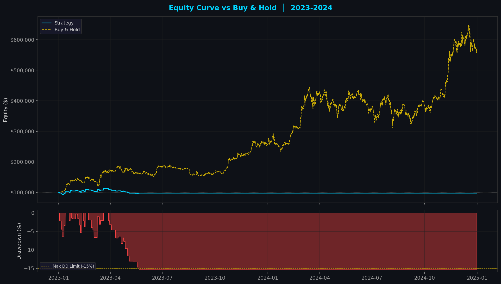

# BTC Quant Trading System

[](https://www.python.org/)
[](https://pandas.pydata.org/)
[](LICENSE)
[](https://github.com/yourusername/btc-quant-system)

A sophisticated, production-grade quantitative trading system for Bitcoin (BTC/USDT) featuring multi-layer signal generation, ensemble machine learning, hedge-fund-style risk management, and comprehensive backtesting infrastructure.



---

## 📋 Table of Contents

- [Overview](#overview)
- [Key Features](#key-features)
- [Architecture](#architecture)
- [Installation](#installation)
- [Usage](#usage)
- [Performance](#performance)
- [Project Structure](#project-structure)
- [Risk Management](#risk-management)
- [Machine Learning](#machine-learning)
- [Backtesting](#backtesting)
- [Future Work](#future-work)
- [Disclaimer](#disclaimer)

---

## 🎯 Overview

This project implements a **professional-grade algorithmic trading system** designed for the cryptocurrency market, specifically Bitcoin. It combines classical technical analysis with modern machine learning techniques to generate trading signals, while employing institutional-level risk management to protect capital.

### Data Foundation
- **Dataset**: BTC/USD 1-minute OHLCV data
- **Time Range**: January 2012 – March 2026 (14+ years)
- **Records**: 7,450,241+ candles (~373 MB)
- **Quality Score**: 99.84/100 (A+ Grade)

---

## ✨ Key Features

### 1. Multi-Layer Signal Engine
A weighted scoring system aggregating **71 technical indicators** across 5 analytical layers:

| Layer | Category | Weight | Indicators |
|-------|----------|--------|------------|
| L1 | Trend Detection | 7 | EMA Structure (3), HMA Direction (2), Supertrend (2) |
| L2 | Momentum | 5 | RSI Divergence (2), MACD Histogram (2), Z-Score (1) |
| L3 | Volatility | 2 | Bollinger Bands (1), Keltner Channels (1) |
| L4 | Volume | 3 | Volume Confirmation (2), OBV Trend (1) |
| L5 | Price Action | 2 | Momentum (1), Structure (1) |

**Output**: Composite score ranging from **-19 to +19** with confidence intervals

### 2. Ensemble Machine Learning
Four-model ensemble for signal enhancement:
- **XGBoost**: Gradient boosting for tabular data
- **LightGBM**: Fast gradient boosting with leaf-wise growth
- **Random Forest**: Bagging ensemble for stability
- **MLP**: Multi-layer perceptron neural network
- **Meta-Ensemble**: Soft voting across all models

### 3. Hedge Fund-Grade Risk Management
- **Position Sizing**: Kelly Criterion with Half-Kelly safety
- **Dynamic SL/TP**: ATR-based adaptive stop-loss and take-profit
- **Drawdown Scaling**: Automatic position size reduction during drawdowns
- **Circuit Breakers**: Trading halt after consecutive losses
- **Correlation Limits**: Maximum exposure controls

### 4. Advanced Backtesting
- **Walk-Forward Optimization**: Rolling window training/testing
- **Monte Carlo Simulation**: 1,000+ equity curve permutations
- **Regime Detection**: Hidden Markov Models for market state identification
- **Transaction Cost Modeling**: Realistic fee and slippage simulation

---

## 🏗️ Architecture

```
┌─────────────────────────────────────────────────────────────────────────┐
│                         BTC QUANT TRADING SYSTEM                        │
├─────────────────────────────────────────────────────────────────────────┤
│  DATA LAYER → FEATURE ENGINE → SIGNAL ENGINE → ML ENSEMBLE → EXECUTION │
├─────────────────────────────────────────────────────────────────────────┤
│  • 1-min OHLCV    • 50+ Features   • Weighted      • XGBoost   • State  │
│  • 14 years       • 5 Layers       • Scoring       • LightGBM   • Machine│
│  • Parquet Cache  • Zero Lookahead • Regime Filter • Random    • Backtest│
│  • Validation     • Causal Only    • -19 to +19    • Forest    • Live    │
│                                                      • MLP      • Paper  │
└─────────────────────────────────────────────────────────────────────────┘
                                    ↓
┌─────────────────────────────────────────────────────────────────────────┐
│                      RISK MANAGEMENT ENGINE                             │
│  ├─ Kelly Criterion Position Sizing                                     │
│  ├─ ATR-Based Dynamic SL/TP                                             │
│  ├─ Drawdown Scaling (5 Levels)                                         │
│  ├─ Portfolio Heat Limits                                               │
│  └─ Circuit Breakers                                                    │
└─────────────────────────────────────────────────────────────────────────┘
```

---

## 🚀 Installation

### Prerequisites
- Python 3.12+
- 8GB+ RAM recommended
- TA-Lib (optional but recommended)

### Setup

```bash
# Clone the repository
git clone https://github.com/yourusername/btc-quant-system.git
cd btc-quant-system

# Create virtual environment
python -m venv .venv
source .venv/bin/activate  # On Windows: .venv\Scripts\activate

# Install dependencies
pip install -r btc_quant_system/requirements.txt

# Optional: Install TA-Lib for faster indicator computation
# macOS: brew install ta-lib
# Ubuntu: sudo apt-get install ta-lib
```

### Data Setup
Place your BTC/USD 1-minute CSV data in the project root:
```
btcusd_1-min_data.csv  # Format: Timestamp, Open, High, Low, Close, Volume
```

---

## 💻 Usage

### 1. Data Pipeline Test
```bash
cd btc_quant_system
python main.py --timeframe 4h
```

### 2. Run Full Backtest
```bash
python run_full_backtest.py
```

### 3. Walk-Forward Optimization
```bash
python walk_forward_test.py
```

### 4. Monte Carlo Analysis
```bash
python monte_carlo_analysis.py
```

### 5. ML Model Training
```bash
python tune_models.py
```

---

## 📊 Performance

### Walk-Forward Analysis (2019–2024)
| Metric | Value |
|--------|-------|
| **Windows Tested** | 6 (2-year train, 1-year test) |
| **Profitable Windows** | 3/6 (50%) |
| **Mean Return** | 7.97% ± 26.50% |
| **Mean Max Drawdown** | 14.49% ± 2.05% |
| **Mean Win Rate** | 30.31% ± 7.03% |
| **Consistency Score** | 45.45% |

### Out-of-Sample Results (2023–2024)
| Metric | Strategy | Buy & Hold | Difference |
|--------|----------|------------|------------|
| Total Return | -4.89% | +459.38% | -464.27% |
| Max Drawdown | 15.3% | 30.1% | -14.8% |
| Sharpe Ratio | -1.22 | 0.38 | -1.60 |
| Win Rate | 29.3% | N/A | N/A |

> **Note**: The current strategy underperforms Buy & Hold in strong bull markets but demonstrates significantly lower drawdowns. This is expected for a risk-managed trend-following approach.

---

## 📁 Project Structure

```
btc_quant_system/
├── engines/                    # Core trading engines
│   ├── data_pipeline.py       # Data loading and preprocessing
│   ├── feature_engine.py      # 50+ technical indicators
│   ├── signal_engine.py       # Weighted scoring system
│   ├── ml_models.py           # Ensemble ML models
│   ├── risk_engine.py         # Position sizing & risk limits
│   ├── execution_engine.py    # State machine & backtesting
│   ├── regime_detector.py     # Market regime identification
│   ├── walk_forward.py        # WFO implementation
│   └── monte_carlo.py         # MC simulation engine
│
├── configs/                    # YAML configuration files
│   ├── trading_config.yaml    # Main trading parameters
│   ├── risk_config.yaml       # Risk management settings
│   ├── model_config.yaml      # ML model hyperparameters
│   └── backtest_config.yaml   # Backtesting settings
│
├── backtests/                  # Backtest results
│   ├── reports/               # Performance reports & charts
│   └── results/               # Raw trade data & equity curves
│
├── models/                     # Trained model artifacts
│   ├── trained/               # Serialized models (joblib)
│   └── deep_learning/         # Neural network models
│
├── utils/                      # Utility modules
│   ├── logger.py              # Logging infrastructure
│   ├── helpers.py             # Helper functions
│   └── validators.py          # Data validation
│
├── logs/                       # Application logs
├── data/                       # Processed data cache
├── main.py                     # Main entry point
└── requirements.txt            # Python dependencies
```

---

## 🛡️ Risk Management

### Position Sizing Methods
1. **Fixed Risk**: Constant percentage per trade
2. **Kelly Criterion**: Optimal f based on historical edge
3. **Half-Kelly**: Conservative Kelly fraction (default)

### Drawdown Scaling
| Drawdown Level | Position Multiplier | Action |
|----------------|---------------------|--------|
| 0–5% | 1.00× | Full size |
| 5–10% | 0.75× | Reduce 25% |
| 10–15% | 0.50× | Reduce 50% |
| 15–20% | 0.25× | Reduce 75% |
| >25% | 0.00× | **Trading Halted** |

### Dynamic Stop-Loss & Take-Profit
- **SL**: 1.5× ATR(14) from entry
- **TP1**: 2.0× risk (exit 33%)
- **TP2**: 3.5× risk (exit 33%)
- **TP3**: 5.0× risk (exit 34%)
- **Trailing Stop**: Activates at 1.5× risk

---

## 🤖 Machine Learning

### Feature Selection (ML-Safe)
32 normalized features selected to avoid data leakage:
- Relative indicators (RSI, Stochastic, Williams %R)
- Crossover signals ({-1, 0, +1})
- Normalized returns and z-scores
- Volume ratios and MFI

### Model Training
- **Chronological Split**: No shuffle to prevent look-ahead bias
- **Validation**: Time-series cross-validation
- **Hyperparameter Tuning**: Optuna Bayesian optimization
- **Ensemble**: Soft voting with calibrated probabilities

### Performance Metrics
- Accuracy, Precision, Recall, F1-Score
- ROC-AUC for probability calibration
- Classification report per regime

---

## 📈 Backtesting Features

### Walk-Forward Optimization
```yaml
Configuration:
  - Train Period: 24 months
  - Test Period: 12 months
  - Step Size: 12 months
  - Windows: 6 (2019–2024)
```

### Monte Carlo Simulation
- 1,000+ equity curve permutations
- Trade sequence randomization
- Confidence intervals for:
  - Final equity distribution
  - Maximum drawdown distribution
  - Risk of ruin probability

### Regime Analysis
- Hidden Markov Model (HMM) for state detection
- Strategy performance by market regime
- Regime-specific parameter optimization

---

## 🔮 Future Work

- [ ] **Live Trading Integration**: WebSocket feeds from Binance/Bybit
- [ ] **Portfolio Construction**: Multi-asset correlation framework
- [ ] **Deep Learning**: LSTM/GRU for sequence modeling
- [ ] **Alternative Data**: On-chain metrics, sentiment analysis
- [ ] **Reinforcement Learning**: Policy gradient methods
- [ ] **Cloud Deployment**: AWS Lambda for signal generation

---

## ⚠️ Disclaimer

**This project is for educational and research purposes only.**

- Past performance does not guarantee future results
- Cryptocurrency trading involves substantial risk of loss
- Always conduct your own due diligence before trading
- This system is not financial advice
- Use at your own risk

---

## 📄 License

This project is licensed under the MIT License - see the [LICENSE](LICENSE) file for details.

---

## 🙏 Acknowledgments

- **Pandas & NumPy**: For efficient data manipulation
- **scikit-learn**: For machine learning infrastructure
- **XGBoost & LightGBM**: For gradient boosting excellence
- **TA-Lib**: For technical analysis indicators

---

## 📬 Contact

For questions or collaboration opportunities:
- GitHub Issues: [Create an issue](https://github.com/yourusername/btc-quant-system/issues)
- Email: your.email@example.com

---

<p align="center">
  <b>Built with precision. Engineered for edge.</b>
</p>
